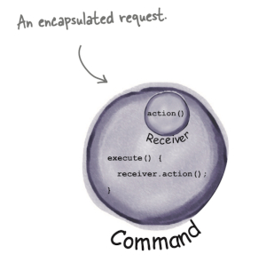

> `The Command Pattern` encapsulates a request as an object, thereby letting you parameterize other objects with different requests, queue or log requests, and support undoable operations.



# Use Case
In the Chapter 6 of `HFDP Book`, we would like to decouple the remote and devices; and we able to plugged different devices to remote's slots and control *on*, *off* by pressing buttons.

# Command 1
In a simple form, imagine there is only one slot on the remote control. For simplicity, we suppose `Command` will not update the *receiver*, and `receiver` will be `moved`. Similar to what we did in `Observer Pattern`, we can use `Rc<Ref<dyn T>>` to make it possible, and we adopt such design in `Command 2`.

```rust
struct SimpleRemoteControl {
    slot: Box<dyn Command>,
}
```

Note that in Java, we could use `@FunctionalInterface` to simplify code by lambda expressions (i.e., without implementing `Command` explicitly).

```java
Light light = new Light();
remote.setCommand(light::on);
```

# Command 2
In this case, the remote control have multiple slots, and in our code, we set it to be `4`. Since `Box<dyn Command>` does not implement `Clone` trait, `vec![Box::new(NoCommand); 4]` is not allowed.

# Command Undo
Implementing `undo` is very easy in `Command Pattern`, and the only difference is to remember the last state; we encapsulate *undo* as a command. Again, the assignment is not allowed:
```rust
// Cannot move
self.undo_command = self.on_commands[slot];
```

There are several solutions. One is to make `Box<dyn Command>` clone-able. See more at [How to clone a struct storing a boxed trait object?](https://stackoverflow.com/questions/30353462). Another choice is to change `Box<dyn Command>` to `Rc<RefCell<dyn Command>>`.
